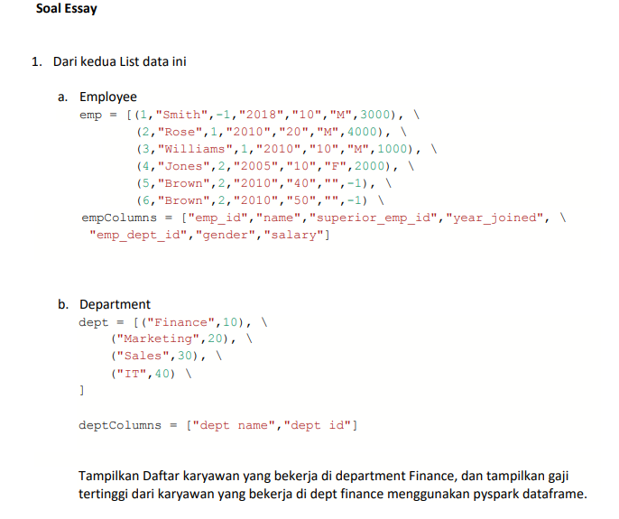

# Data Analytics with Spark



Berikut adalah langkah-langkah untuk melakukan data analytics dengan Spark.

```python
emp = [
       (1, "Smith", -1, "2018", "10", "M", 3000), \
       (2, "Rose", 1, "2010", "20", "M", 4000), \
       (3, "Williams", 1, "2010", "10", "M", 1000), \
       (4, "Jones", 2, "2005", "10", "F", 2000), \
       (5, "Brown", 2, "2010", "40", "", -1), \
       (6, "Brown", 2, "2010", "50", "", -1) \
      ]

empColumns = ["emp_id", "name", "superior_emp_id", "year_joined", \
              "emp_dept_id", "gender", "salary"]

dept = [("Finance", 10), \
        ("Marketing", 20), \
        ("Sales", 30), \
        ("IT", 40) \
      ]

deptColumns = ["dept name", "dept id"]
```

Memasukkan data dan juga schema ke dalam bentuk spark dataframe

```python
emp_df = spark.createDataFrame(data=emp, schema=empColumns)
dept_df = spark.createDataFrame(data=dept, schema=deptColumns)
```

Untuk menampilkan data, bisa dengan menggunakan perintah `emp_df.show()` dan `dept_df.show()`.

Pada tabel `emp`, terdapat kolom `emp_dept_id` yang merujuk pada tabel `dept`. Hanya saja, nama kolom pada tabel `dept` perlu diubah agar dapat dilakukan `join`.

```python
# ubah nama kolom
new_dept_df = dept_df.withColumnRenamed('dept name', 'dept_name').withColumnRenamed('dept id', 'dept_id')
new_dept_df.printSchema()
```

Join kedua tabel dimana `new_dept_df.dept_id` sama dengan `emp_df.emp_dept_id`.

```python
#Inner Join 
joined_df = emp_df.join(new_dept_df,emp_df.emp_dept_id ==  new_dept_df.dept_id,"inner")
joined_df.show(truncate=False)
```
## Menampilkan daftar karyawan yang bekerja di departemen `Finance`, dan tampilkan gaji tertinggi `(max salary)` dari karyawan yang bekerja di departemen `Finance` menggunakan `pyspark dataframe`.

Ada dua cara, bisa menggunakan query SQL atau menggunakan query bawaan dari Spark.

### Cara 1

```python
joined_df.createOrReplaceTempView("join_table") # Buat view baru

result1 = spark.sql("SELECT name FROM join_table WHERE dept_name='Finance'")
print("== Daftar karyawan yang bekerja di departemen Finance ==")
result1.show()
```

```python
result2 = spark.sql("SELECT name, salary FROM join_table WHERE dept_name='Finance' AND salary = (SELECT max(salary) FROM join_table WHERE dept_name='Finance')")
print("== Daftar karyawan yang bekerja di departemen Finance yang memiliki gaji tertinggi ==")
result2.show()
```

### Cara 2

```python
# Import fungsi max
from pyspark.sql.functions import max
```

```python
result3 = joined_df.filter(joined_df.dept_name == 'Finance').select("name")
result3.show()
```

```python
# Dapatkan salary tertinggi di departemen Finance
max_salary_in_finance = joined_df.filter("dept_name == 'Finance'").select(max("salary")).collect()[0]['max(salary)']
# Print bersama dengan nama
result4 = joined_df.filter((joined_df.dept_name == "Finance") & (joined_df.salary == max_salary_in_finance)).select("name", "salary")
result4.show()
```