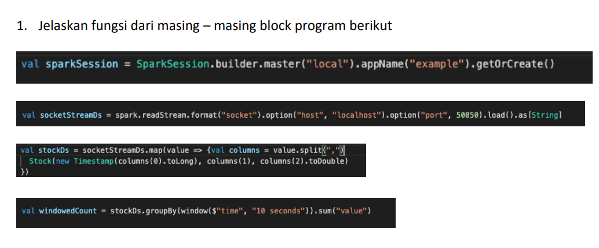

# Spark Pararellism and Streaming

**Homework**



**Penjelasan**

```scala
val sparkSession = SparkSession.builder.master("local").appName("example").getOrCreate()
```

Kode di atas merupakan kode untuk membuat `SparkSession` dengan cluster manager menggunakan `local` dan nama aplikasinya adalah `example`.


```scala
val socketStreamDs = spark.readStream.format("socket").option("host", "localhost").option("port", 50050).load().as[String]
```

Kode di atas merupakan kode untuk load dataset streaming dari `Socket` dengan option dari host mana (`localhost`) dengan port `50050`. Hasilnya akan di-_casting_ dalam bentuk `String`.


```scala
val stockDs = socketStreamDs.map(value => {
    val columns = value.split(",")
    Stock(new Timestamp(columns(0).toLong), columns(1), columns(2).toDouble)
})
```

Sebelumnya, sudah bibuat class `Stock` yang berisi `time`, `symbol`, dan `value`. Model ini akan men-_track_ stock price di waktu tertentu. 

Pada kode di atas, ketika data masuk ke dalam `Socket` yang mana dalam bentuk `String`, i.e. `1461756867001,"aapl",200.0`, maka hasilnya akan dilakukan ekstraksi dengan method `split` berdasarkan tanda koma (`,`) dan dimasukkan ke dalam variabel `columns`. Kemudian, data tersebut akan dimasukkan ke dalam object baru `Stock` yang nilai dari `time`, `symbol`, dan `value` mengambil data di `columns`. Karena bentuknya masih `String`, perlu dilakukan `casting` ke tipe data yang sesuai (`time`: Timestamp, `symbol`: String, `value`: Double).   


```scala
val windowedCount = stockDs.groupBy(window($"time", "10 seconds")).sum("value")
```

Kode di atas digunakan untuk melakukan agregrasi stok value dengan window 10 detik terakhir.